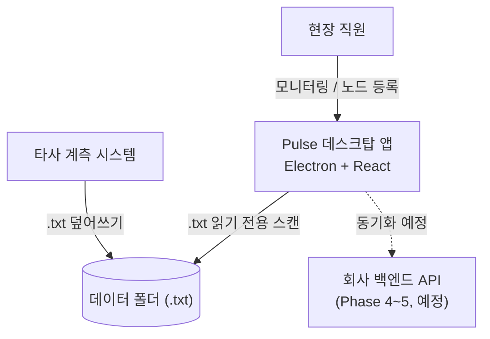
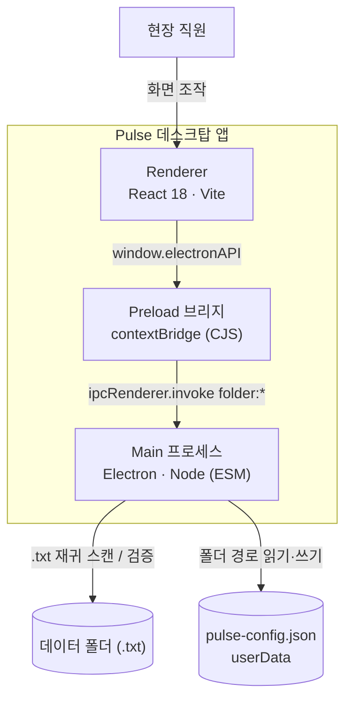
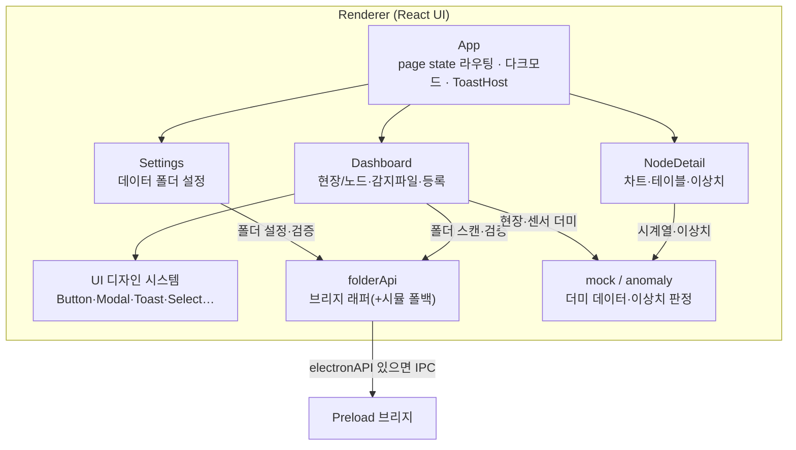

# Pulse 아키텍처

Pulse 가 전체적으로 어떻게 구성되는지를 **레고 설명서처럼 위에서 아래로 분해**해 보여줍니다. ([C4 모델](https://c4model.com/))

- **Lv1 Context** — 시스템과 주변(사람·외부 시스템)
- **Lv2 Container** — Pulse 내부의 큰 덩어리
- **Lv3 Component** — 각 덩어리 안의 부품

> 아래 다이어그램은 문서에 바로 보이는 **Mermaid** 버전입니다. 클릭하며 줌인하는 **인터랙티브 버전**은 맨 아래 [인터랙티브로 보기](#인터랙티브로-보기-likec4) 참고. 두 버전의 원본 모델은 [`pulse.c4`](pulse.c4).
>
> "왜" 그렇게 정했는지는 [결정 기록(ADR)](../decisions/), "무엇이" 바뀌었는지는 [CHANGELOG](../../CHANGELOG.md).

---

## Lv1. Context — 시스템 전경



타사 시스템이 PC의 데이터 폴더에 센서 `.txt` 를 **덮어쓰면**, Pulse 가 그것을 읽어 직원에게 보여주고 검증한다. 검증된 데이터의 백엔드 동기화는 예정 단계다.

## Lv2. Container — Pulse 내부 구성



`contextIsolation` 환경이라 렌더러는 메인에 직접 접근하지 못하고 **Preload 의 `window.electronAPI` 만**으로 통신한다. 파일시스템 접근은 전부 Main 에서만.

## Lv3. Component — Renderer (화면)



`folderApi` 는 `window.electronAPI` 가 있으면 실제 IPC, 없으면(브라우저/E2E 테스트) 시뮬레이션으로 폴백한다 — 그래서 Electron 없이도 렌더러를 띄워 테스트할 수 있다.

---

## 데이터 흐름 (런타임 시나리오)

**폴더 스캔(감지된 파일):** `Dashboard` → `folderApi.scanFolder()` → `electronAPI` → `folder:scan` IPC → `folderService.scanFolder()` 가 데이터 폴더의 `.txt` 를 재귀 수집·분석(크기/행수/인코딩) → 렌더러가 목록 표시. **원본 `.txt` 는 읽기 전용**, 절대 수정하지 않는다.

**노드 등록:** 현재는 렌더러 `useState` 시뮬레이션이라 **재시작 시 휘발**한다. 영속(SQLite)·실제 파싱·폴링은 Phase 2~ 예정. (`CLAUDE.md` Phase 로드맵 참고)

## 기술 스택 · 핵심 제약

- Electron 42 + React 18 + Vite (Electron Forge), Tailwind v3, lucide-react, recharts
- 원본 `.txt` 불변(읽기 전용), 수정은 우리 DB 에서만 (Phase 2~)
- 디자인: zinc 팔레트 · lucide 아이콘만(이모지 금지) · 다크모드 완전 지원
- 영속: 데이터 폴더 경로(`pulse-config.json`) / 다크모드(localStorage) / 노드·측정값(현재 메모리)

## 결정 기록 · 변경 이력

- [결정 기록 (ADR)](../decisions/) — 왜 그렇게 정했나
- [CHANGELOG](../../CHANGELOG.md) — 무엇이 바뀌었나 (타팀 보고용)

---

## 인터랙티브로 보기 (LikeC4)

클릭해서 레벨을 줌인하는 인터랙티브 다이어그램입니다. 설치 없이 npx 로 실행합니다.

```bash
# pulse/ 에서
npm run arch          # 브라우저에서 인터랙티브 웹뷰 열기
npm run arch:build    # 정적 사이트 생성 → docs/architecture/dist
```

모델 원본은 [`pulse.c4`](pulse.c4) 한 파일입니다. 요소·관계를 거기서 고치면 Mermaid 다이어그램(위)도 같이 갱신해 주세요. (둘은 수동 동기화입니다.)
